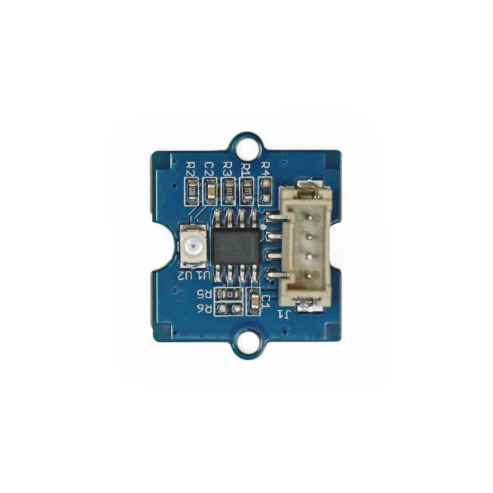

---
title: "UV-Lichtsensor"
date: "2018-10-01T12:49:38.000Z"
tags: 
  - "sensor"
coverImage: "mys_mk_6.jpg"
material_number: "6"
material_type: "sensor"
material_short_descr: "Seeed Studio Grove - UV Sensor"
manufacture: "Seeed Studio"
manufacture_url: "https://www.seeedstudio.com/"
repo_name: "mks-SeeedStudio-Grove_UV_Sensor"
product_url: "https://wiki.seeedstudio.com/Grove-UV_Sensor/"
clone_url: "https://github.com/Make-Your-School/mks-SeeedStudio-Grove_UV_Sensor.git"
repo_prefix: "mks"
repo_part: "Grove_UV_Sensor"
embedded_example_file: "examples/Grove_UV_Sensor_minimal/Grove_UV_Sensor_minimal.ino"
---

# UV-Lichtsensor

## Beschreibung
Der UV-Lichtsensor erfasst die Intensität der auf ihn einwirkenden Ultraviolettstrahlung (kurz: UV). UV-Strahlung ist eine elektromagnetische Strahlung mit einer Wellenlänge zwischen 10 nm (Nanometer) und 380 nm. Die Wellenlänge ist damit länger als die von Röntgenstrahlung und kürzer als die von sichtbarem, violettem Licht. UV-Strahlung ist für das menschliche Auge unsichtbar und ist bspw. im kurzwelligen Anteil der Sonnenstrahlung enthalten.

Die Sensibilität des Sensors ist am höchsten bei einer Strahlung mit einer Wellenlänge zwischen 200 nm und 400 nm. Dadurch erfasst der Sensor sowohl UV-Strahlung als auch einen geringen Anteil des sichtbaren violetten Lichts.

Der Sensor kann direkt oder mithilfe des Grove Shields an einen Arduino oder Raspberry Pi angeschlossen werden. Der Sensor wird dabei an einen analogen Eingang angeschlossen.

Das Modul wird beispielsweise in einer Messstation für Umweltdaten, wie Feinstaub, Lautstärke, Luftfeuchtigkeit, Temperatur und UV-Strahlung eingesetzt.

Alle weiteren Hintergrundinformationen sowie ein Beispielaufbau und alle notwendigen Programmbibliotheken sind auf dem offiziellen Wiki (bisher nur in englischer Sprache) von Seeed Studio zusammengefasst. Zusätzlich findet man über alle gängigen Suchmaschinen durch die Eingabe der genauen Komponentenbezeichnung entsprechende Projektbeispiele und Tutorials.

<!-- infolist -->

<!-- infolists -->
## Wichtige Links für die ersten Schritte:

- [Seeed Studio Wiki – UV Sensor](https://wiki.seeedstudio.com/Grove-UV_Sensor/) 

## Weiterführende Hintergrundinformationen:

- [UV-Strahlung – Wikipedia Artikel](https://de.wikipedia.org/wiki/Ultraviolettstrahlung)
- [Spektrum Elektromagnetische Strahlung – Wikipedia Artikel](https://de.wikipedia.org/wiki/Elektromagnetisches_Spektrum)
- [GitHub-Repository: UV-Lichtsensor](https://github.com/MakeYourSchool/6-UV-Lichtsensor)

